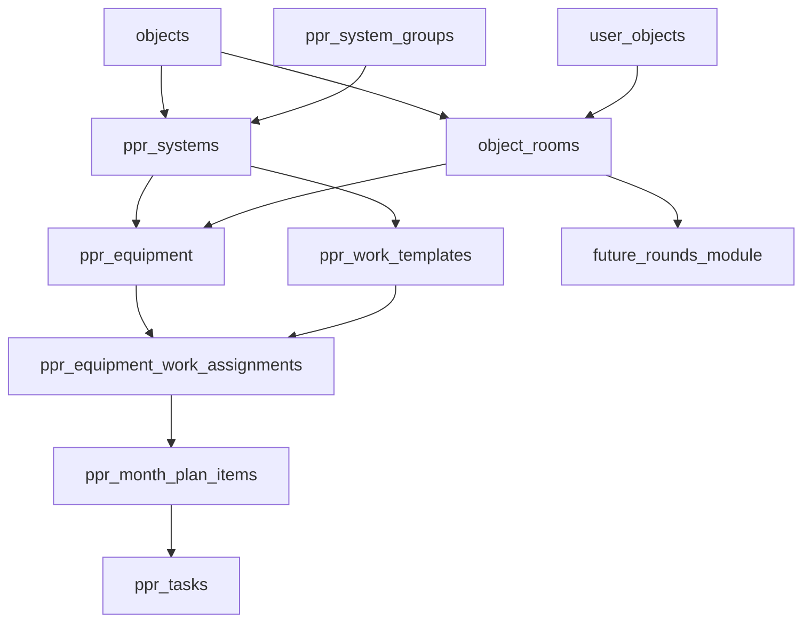

# Архитектура модуля ППР

## 1. Цель

`ppr` остается отдельным вертикальным срезом внутри `unaittasks`, но переводится на исправленную доменную модель:

- `Группа систем -> Система -> Оборудование`
- помещения больше не являются PPR-справочником
- помещения выносятся в общий объектовый справочник `object_rooms`
- ППР использует `object_rooms` как shared dependency

Ключевой принцип не меняется:

- `ppr_tasks` не смешиваются с обычными `tasks`
- UI, API и workflow ППР остаются изолированными
- общий проект переиспользует auth, roles, objects, user_objects, audit и layout

## 2. Итоговая доменная модель

### 2.1 Shared-слой

- `objects`
- `user_objects`
- `object_rooms`

`object_rooms` это общий справочник помещений уровня объекта, пригодный и для ППР, и для будущего модуля обходов.

### 2.2 PPR-слой

- `ppr_system_groups`
- `ppr_systems`
- `ppr_equipment`
- `ppr_work_templates`
- `ppr_work_checklist_items`
- `ppr_equipment_work_assignments`
- `ppr_month_plans`
- `ppr_month_plan_items`
- `ppr_tasks`
- `ppr_task_work_items`
- `ppr_task_comments`
- `ppr_task_attachments`
- `ppr_equipment_qr_codes`
- `ppr_equipment_attachments`

### 2.3 Что удалено из целевой модели

- `ppr_subsystems`
- `subsystem_id` из `ppr_equipment`
- `subsystem_id` из `ppr_work_templates`
- `subsystem_id` из `ppr_month_plan_items`
- `subsystem_id` из `ppr_tasks`
- PPR-specific справочник `ppr_rooms`

## 3. Связи между сущностями

Правила:

- оборудование принадлежит системе напрямую
- шаблон ППР принадлежит системе напрямую
- совместимость назначения проверяется по `object_id + system_id`
- помещение принадлежит объекту, а не ППР
- `ppr_tasks` materialize-ятся по `(object_id, equipment_id, planned_for)`

## 4. App-слой

### 4.1 Страницы

- `app/(dashboard)/ppr/page.tsx`
- `app/(dashboard)/ppr/systems/page.tsx`
- `app/(dashboard)/ppr/rooms/page.tsx`
- `app/(dashboard)/ppr/equipment/page.tsx`
- `app/(dashboard)/ppr/equipment/[id]/page.tsx`
- `app/(dashboard)/ppr/templates/page.tsx`
- `app/(dashboard)/ppr/templates/[id]/page.tsx`
- `app/(dashboard)/ppr/assignments/page.tsx`
- `app/(dashboard)/ppr/calendar/page.tsx`
- `app/(dashboard)/ppr/tasks/page.tsx`
- `app/(dashboard)/ppr/tasks/[id]/page.tsx`
- `app/(dashboard)/ppr/my/page.tsx`
- `app/(dashboard)/ppr/archive/page.tsx`
- `app/(dashboard)/ppr/qr/[token]/page.tsx`

Маршрут `/ppr/subsystems` удален как устаревший.

### 4.2 Backend

- `app/actions/ppr-directory-actions.ts`
- `app/actions/ppr-template-actions.ts`
- `app/actions/ppr-calendar-actions.ts`
- `app/actions/ppr-task-actions.ts`
- `app/actions/object-room-actions.ts`
- `app/api/ppr/*`

### 4.3 Lib

- `lib/ppr/types.ts`
- `lib/ppr/validators.ts`
- `lib/ppr/permissions.ts`
- `lib/ppr/queries.ts`
- `lib/ppr/scheduler.ts`
- `lib/ppr/task-lifecycle.ts`
- `lib/ppr/qr.ts`
- `lib/object-rooms.ts`

## 5. База данных

### 5.1 Основные таблицы

#### Shared

- `object_rooms`

#### PPR

- `ppr_system_groups`
- `ppr_systems`
- `ppr_equipment`
- `ppr_work_templates`
- `ppr_work_checklist_items`
- `ppr_equipment_work_assignments`
- `ppr_month_plans`
- `ppr_month_plan_items`
- `ppr_tasks`
- `ppr_task_work_items`
- `ppr_task_comments`
- `ppr_task_attachments`
- `ppr_equipment_qr_codes`
- `ppr_equipment_attachments`

### 5.2 Ключевые поля

#### `object_rooms`

- `id`
- `object_id`
- `name`
- `floor`
- `description`
- `is_active`

#### `ppr_equipment`

- `object_id`
- `system_id`
- `room_id`
- `inventory_no`
- `name`
- `dispatch_name`
- `service_start_date`

#### `ppr_work_templates`

- `object_id`
- `system_id`
- `name`
- `period_months`
- `base_start_date`
- `norm_hours`
- `methodology`

#### `ppr_month_plan_items`

- `object_id`
- `system_id`
- `equipment_id`
- `assignment_id`
- `template_id`
- `planned_for`
- `source_due_date`
- `status`

#### `ppr_tasks`

- `object_id`
- `system_id`
- `equipment_id`
- `responsible_user_id`
- `assignee_id`
- `planned_for`
- `status`
- `is_overdue`
- `is_rescheduled`

## 6. RLS и доступ

### 6.1 Shared rooms

`object_rooms` имеют собственный shared-RLS слой:

- `can_read_object_room(_object_id)`
- `can_manage_object_room(_object_id)`

Доступ строится через:

- `current_role()`
- `has_object_access(_object_id, auth.uid())`
- роли `admin`, `chief`, `lead`, `engineer`, `object_engineer`

### 6.2 PPR

PPR продолжает использовать:

- `ppr_current_role()`
- `ppr_has_object_access(_object_id)`
- `ppr_can_manage_structure(_object_id)`
- `ppr_can_manage_templates(_object_id)`
- `ppr_can_manage_assignments(_object_id)`
- `ppr_can_manage_calendar(_system_id)`
- `ppr_can_read_task(_task)`
- `ppr_can_assign_executor(_task)`
- `ppr_can_close_task(_task)`

Важно:

- `ppr_has_object_access()` выровнен с общей моделью `has_object_access()`
- object-scope остается базовым способом ограничения данных

## 7. Workflow

### 7.1 Шаблон

- создается на уровне системы
- содержит периодичность, базовую дату, чек-лист, нормо-часы и методику

### 7.2 Назначение

- связывает шаблон и оборудование
- разрешено только в рамках одной системы и одного объекта

### 7.3 Календарь

- создается месячный план по системе
- строки плана хранят конкретные due dates и `planned_for`
- `subsystem` в календаре больше не участвует

### 7.4 Materialization

- одна активная `ppr_task` на одно оборудование и одну плановую дату
- grouping key: `(object_id, equipment_id, planned_for)`
- `ppr_task_work_items` хранят snapshot работ

### 7.5 Выполнение

- исполнитель назначается на уровне готовой `ppr_task`
- `done` требует комментарий и фото
- `closed` и `cancelled` уходят в архив через фильтры

## 8. QR и cron

QR-логика не меняется концептуально:

- QR закреплен за оборудованием
- по токену открывается активная заявка либо карточка оборудования

Cron-логика сохраняет трехшаговый pipeline:

- carryover
- materialization
- sync plan item statuses

После рефакторинга cron и SQL RPC больше не используют `subsystem_id`.

## 9. Практические ограничения

- `main` остается стабильным и не получает PPR-специфичных изменений напрямую
- доработка ведется в ветке `feature/ppr`
- общий справочник помещений проектируется сразу с прицелом на обходы
- `ppr_tasks` и `tasks` остаются независимыми доменами
