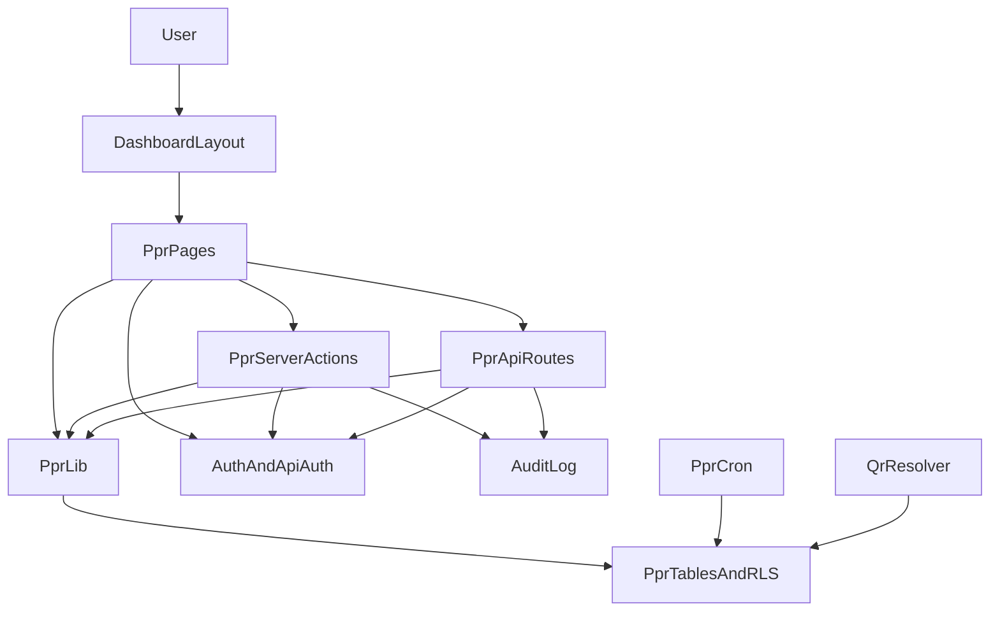

# Архитектура модуля ППР

## 1. Цель

Модуль `ppr` внедряется как отдельный домен внутри существующего репозитория `unaittasks`.
Он не заменяет и не расширяет текущий модуль обычных задач, а живет рядом с ним на общем инфраструктурном каркасе:

- `Next.js App Router`
- `TypeScript`
- `Supabase`
- `RLS`
- `PWA`
- `Docker`

Ключевой принцип: переиспользуем общий каркас приложения, но не смешиваем сущности, workflow и права ППР с существующими `tasks`.

UI модуля `ppr` реализуется в текущем UI-подходе проекта:

- существующие layout и navigation
- существующие `components/ui/*`
- существующий CSS/Tailwind-подход проекта

Локально внедрять `shadcn/ui` в модуль `ppr` не нужно.

---

## 2. Базовое решение

- ППР внедряется внутрь текущего приложения, а не как отдельный репозиторий.
- ППР-заявка хранится в отдельной таблице `ppr_tasks`, а не в `tasks`.
- Модуль ППР получает собственные:
  - страницы `app/(dashboard)/ppr/*`
  - API routes `app/api/ppr/*`
  - server actions `app/actions/ppr-*.ts`
  - компоненты `components/ppr/*`
  - бизнес-логику `lib/ppr/*`
  - SQL migrations `supabase/migrations/0010+_ppr_*.sql`
- Общие механизмы проекта используются повторно:
  - авторизация и профили
  - роли
  - объекты и доступ к объектам
  - аудит
  - layout и navigation
  - Supabase clients
  - PWA-обвязка
  - Docker / VPS deploy

---

## 3. Что переиспользуем из текущего проекта

### 3.1 Auth и профиль

- `lib/auth.ts`
- `lib/api-auth.ts`
- `lib/supabase/server.ts`
- `lib/supabase/browser.ts`
- `lib/supabase/admin.ts`

Использование:

- серверные страницы и actions работают через `requireProfile()`
- API routes работают через `getApiSession()`
- `SUPABASE_SERVICE_ROLE_KEY` используется только на сервере

### 3.2 Роли и доступ к объектам

- `profiles`
- `objects`
- `user_objects`

Правило:

- все объектовые сущности ППР должны фильтроваться по `object_id`
- доступ определяется через текущую модель ролей + объектовый доступ из `user_objects`

### 3.3 Аудит

- таблица `audit_log`
- helper `lib/audit.ts`

Через `audit_log` фиксируем:

- создание и изменение структуры
- создание и изменение шаблонов
- назначения на оборудование
- генерацию ППР-заявок
- назначение исполнителя
- смену статусов
- перенос
- отмену
- закрытие
- комментарии и вложения

### 3.4 Layout, navigation, dashboard shell

- `app/(dashboard)/layout.tsx`
- `components/dashboard/main-nav.tsx`
- `components/dashboard/mobile-tabs.tsx`
- общие UI-примитивы в `components/ui/*`

### 3.5 PWA и mobile shell

- `components/pwa/register-sw.tsx`
- `public/sw.js`
- `public/manifest.webmanifest`

Важно:

- PWA используем как install/mobile shell
- offline-first в этап 1 не включаем
- service worker не расширяем до сложной доменной offline-логики

### 3.6 Docker и окружение

- текущий `Dockerfile`
- `docker-compose.yml`
- `Caddyfile`

Новый модуль не требует отдельной инфраструктуры.

---

## 4. Что создаем отдельно

### 4.1 Отдельный доменный срез `ppr`

- свои маршруты
- свои таблицы
- свои permission helpers
- свои server actions и API routes
- свои представления и карточки

### 4.2 Отдельная модель workflow

Текущий task-модуль:

- `new`
- `accepted`
- `in_progress`
- `paused`
- `done`

ППР-модуль:

- `new`
- `in_progress`
- `done`
- `closed`
- `cancelled`

Дополнительные признаки:

- `is_overdue`
- `is_rescheduled`

### 4.3 Отдельная предметная структура

Сущности ППР:

- группы систем
- системы
- подсистемы
- помещения
- оборудование
- шаблоны ППР-работ
- чек-листы
- назначения шаблонов на оборудование
- месячный план
- ППР-заявки
- QR-коды оборудования

---

## 5. Границы модуля

### 5.1 Что точно не делаем

- не создаем новый репозиторий
- не используем `tasks` для хранения ППР-заявок
- не превращаем ППР в новый тип обычной задачи
- не вводим отдельную роль `responsible`
- не добавляем склад, ТМЦ, интеграции, Excel-import, сложную аналитику
- не делаем offline-first

### 5.2 Что обязательно соблюдаем

- все рабочие сущности ППР, кроме глобальных справочников, имеют `object_id`
- ответственный по системе хранится полем `responsible_user_id` у системы
- ответственным по системе может быть только:
  - `lead`
  - `engineer`
  - `object_engineer`
- `tech` не может быть ответственным по системе

---

## 6. Поддержка роли object_engineer

В модуле ППР роль `object_engineer` должна поддерживаться как отдельная объектовая управляющая роль.

Правила:

- `object_engineer` не равен `engineer`
- `object_engineer` не исключается из ППР
- `object_engineer` работает только в рамках объектов, доступных через `user_objects`
- `object_engineer` может:
  - видеть все ППР по своим объектам
  - работать с календарем ППР
  - редактировать структуру, шаблоны и назначения по своим объектам
  - назначать исполнителей
  - закрывать ППР
  - быть ответственным по системе

Это означает, что в ППР доступ строится не только по роли, но и по связке:

- `role`
- `user_objects`
- `object_id`
- `responsible_user_id`

---

## 7. Встраивание в App Router

Рекомендуемая структура:

```text
app/
  (dashboard)/
    ppr/
      page.tsx
      my/page.tsx
      calendar/page.tsx
      tasks/page.tsx
      tasks/[id]/page.tsx
      archive/page.tsx
      systems/page.tsx
      subsystems/page.tsx
      rooms/page.tsx
      equipment/page.tsx
      equipment/[id]/page.tsx
      templates/page.tsx
      templates/[id]/page.tsx
      assignments/page.tsx
      qr/[token]/page.tsx
```

Принципы:

- все страницы ППР живут в текущем dashboard layout
- права страницы проверяются через `requireProfile()`
- данные грузятся серверными компонентами
- интерактивность выносится в `components/ppr/*`

---

## 8. Встраивание в API

Рекомендуемый namespace:

```text
app/api/ppr/
```

Основные route groups:

```text
app/api/ppr/
  qr/[token]/route.ts
  tasks/[id]/status/route.ts
  tasks/[id]/assign/route.ts
  tasks/[id]/reschedule/route.ts
  tasks/[id]/cancel/route.ts
  tasks/[id]/comments/route.ts
  tasks/[id]/attachments/route.ts
  cron/run/route.ts
```

Когда используем API routes:

- mobile-first действия через `fetch`
- JSON-сценарии
- multipart upload фото
- QR-резолв
- cron endpoints

---

## 9. Встраивание в Server Actions

Рекомендуемые action-файлы:

```text
app/actions/
  ppr-directory-actions.ts
  ppr-template-actions.ts
  ppr-calendar-actions.ts
  ppr-task-actions.ts
```

Когда использовать server actions:

- создание и редактирование справочников
- формы карточек
- простые CRUD-операции
- операции, где не нужен отдельный JSON API

Когда не использовать actions:

- multipart upload
- QR endpoint
- cron
- мобильные сценарии со сложным client fetch flow

---

## 10. Встраивание в lib

Рекомендуемая структура:

```text
lib/
  ppr/
    types.ts
    validators.ts
    permissions.ts
    queries.ts
    scheduler.ts
    qr.ts
    presentation.ts
```

### Назначение файлов

- `types.ts` — типы ППР
- `validators.ts` — zod-схемы
- `permissions.ts` — матрица прав на уровне приложения
- `queries.ts` — server-side выборки
- `scheduler.ts` — месячный план, генерация заявок, перенос
- `qr.ts` — резолв QR и переходы
- `presentation.ts` — статусы, бейджи, UI-мета

---

## 11. Встраивание в migrations

Рекомендуемый набор:

```text
supabase/migrations/
  0010_ppr_structure.sql
  0011_ppr_equipment_qr.sql
  0012_ppr_templates_assignments.sql
  0013_ppr_calendar.sql
  0014_ppr_tasks.sql
  0015_ppr_files.sql
  0016_ppr_rls.sql
  0017_ppr_cron_rpc.sql
```

Порядок:

- сначала схема и справочники
- затем оборудование и QR
- затем шаблоны и назначения
- затем календарь
- затем заявки вместе с attachment tables
- затем storage/bucket/policies
- затем RLS и RPC

---

## 12. Предлагаемая схема БД

### 12.1 Таблицы

#### Глобальный справочник

- `ppr_system_groups`

#### Объектовая структура

- `ppr_systems`
- `ppr_subsystems`
- `ppr_rooms`
- `ppr_equipment`
- `ppr_equipment_attachments`
- `ppr_equipment_qr_codes`

#### Шаблоны и назначения

- `ppr_work_templates`
- `ppr_work_checklist_items`
- `ppr_work_template_attachments`
- `ppr_equipment_work_assignments`

#### Планирование

- `ppr_month_plans`
- `ppr_month_plan_items`

#### Заявки

- `ppr_tasks`
- `ppr_task_work_items`
- `ppr_task_comments`
- `ppr_task_attachments`

### 12.2 Ключевые поля

#### `ppr_system_groups`

- `id`
- `name`
- `code`
- `is_active`

#### `ppr_systems`

- `id`
- `object_id`
- `system_group_id`
- `name`
- `description`
- `responsible_user_id`
- `is_active`

#### `ppr_subsystems`

- `id`
- `object_id`
- `system_id`
- `parent_id`
- `name`
- `sort_order`
- `is_active`

#### `ppr_rooms`

- `id`
- `object_id`
- `name`
- `floor`
- `description`
- `is_active`

#### `ppr_equipment`

- `id`
- `object_id`
- `system_id`
- `subsystem_id`
- `room_id`
- `inventory_no`
- `name`
- `dispatch_name`
- `service_start_date`
- `status`
- `serial_no`
- `manufacturer`
- `model`
- `description`
- `comment`

#### `ppr_equipment_qr_codes`

- `id`
- `object_id`
- `equipment_id`
- `qr_token`
- `is_active`
- `generated_at`

#### `ppr_equipment_attachments`

- `id`
- `object_id`
- `equipment_id`
- `storage_path`
- `file_name`
- `mime_type`
- `size_bytes`
- `uploaded_by`
- `created_at`

#### `ppr_work_templates`

- `id`
- `object_id`
- `subsystem_id`
- `name`
- `description`
- `period_months`
- `base_start_date`
- `norm_hours`
- `methodology`
- `is_active`

#### `ppr_work_checklist_items`

- `id`
- `object_id`
- `template_id`
- `sort_order`
- `title`
- `description`

#### `ppr_work_template_attachments`

- `id`
- `object_id`
- `template_id`
- `storage_path`
- `file_name`
- `mime_type`
- `size_bytes`
- `uploaded_by`
- `created_at`

#### `ppr_equipment_work_assignments`

- `id`
- `object_id`
- `equipment_id`
- `template_id`
- `start_date`
- `period_months`
- `is_active`

#### `ppr_month_plans`

- `id`
- `object_id`
- `system_id`
- `plan_month`
- `generated_at`

#### `ppr_month_plan_items`

- `id`
- `object_id`
- `month_plan_id`
- `system_id`
- `subsystem_id`
- `equipment_id`
- `assignment_id`
- `template_id`
- `planned_for`
- `source_due_date`
- `is_overdue`
- `is_carried_over`
- `task_id`
- `status`

#### `ppr_tasks`

- `id`
- `object_id`
- `system_id`
- `subsystem_id`
- `equipment_id`
- `responsible_user_id`
- `assignee_id`
- `planned_for`
- `completed_at`
- `closed_at`
- `cancelled_at`
- `cancelled_by`
- `status`
- `is_overdue`
- `is_rescheduled`
- `general_comment`
- `cancel_reason`

`ppr_tasks.responsible_user_id` фиксируется как snapshot на момент создания заявки.

Правило:

- изменение `responsible_user_id` у системы не переписывает уже созданные `ppr_tasks`
- изменения ответственности по системе влияют только на будущие заявки
- если нужен перенос открытых заявок на нового ответственного, это должен быть отдельный explicit flow
- автоматической live-sync логики между `ppr_systems.responsible_user_id` и уже созданными `ppr_tasks` быть не должно

#### `ppr_task_work_items`

- `id`
- `object_id`
- `task_id`
- `assignment_id`
- `template_id`
- `plan_item_id`
- `title_snapshot`
- `checklist_snapshot`
- `norm_hours_snapshot`
- `description_snapshot`
- `methodology_snapshot`
- `sort_order`

Рекомендуемый формат snapshot-полей:

- `title_snapshot` — `text`
- `norm_hours_snapshot` — `numeric`
- `description_snapshot` — `text`
- `methodology_snapshot` — `text`
- `checklist_snapshot` — `jsonb`

`checklist_snapshot` должен хранить структурированный снимок чек-листа на момент создания заявки, а не ссылку на текущий шаблон.
Рекомендуемый формат `jsonb`:

- массив объектов с полями `sort_order`, `title`, `description`

#### `ppr_task_comments`

- `id`
- `object_id`
- `task_id`
- `author_id`
- `body`
- `created_at`

#### `ppr_task_attachments`

- `id`
- `object_id`
- `task_id`
- `comment_id`
- `storage_path`
- `file_name`
- `mime_type`
- `size_bytes`
- `uploaded_by`
- `created_at`

### 12.3 Связи между сущностями

- `objects` 1:N `ppr_systems`
- `ppr_system_groups` 1:N `ppr_systems`
- `ppr_systems` 1:N `ppr_subsystems`
- `ppr_subsystems` 1:N `ppr_equipment`
- `ppr_rooms` 1:N `ppr_equipment`
- `ppr_work_templates` создаются на уровне подсистемы
- `ppr_equipment_work_assignments` связывают шаблон с оборудованием
- `ppr_month_plan_items` строятся из назначений
- связь `ppr_month_plan_items -> ppr_tasks` является `M:1`
- несколько `ppr_month_plan_items` могут ссылаться на одну `ppr_task`
- `task_id` в `ppr_month_plan_items` заполняется только на этапе materialization/create-tasks
- `ppr_tasks` materialize-ятся из календаря по правилу агрегации
- `ppr_task_work_items` группируют несколько работ в одну ППР-заявку

### 12.3а Lifecycle `ppr_month_plan_items`

`ppr_month_plan_items` должны явно отражать переход от календарного плана к materialized заявке и дальше к финальному исходу работы.

Рекомендуемый lifecycle:

- `pending`
  - позиция создана в месячном плане
  - `task_id is null`
- `materialized`
  - позиция вошла в `ppr_task`
  - `task_id` заполнен
- `carried_over`
  - позиция перенесена из прошлого месяца
  - `is_carried_over = true`
- `closed`
  - родительская `ppr_task` закрыта
- `cancelled`
  - родительская `ppr_task` отменена

Точное правило materialization:

- source: `ppr_month_plan_items`
- grouping key: `(object_id, equipment_id, planned_for)`
- результат: одна `ppr_task`
- после materialization одинаковый `task_id` записывается во все plan items, вошедшие в эту агрегированную задачу
- если дата вручную не распределена, `planned_for` устанавливается на `1` число соответствующего месяца
- `responsible_user_id` в созданной `ppr_task` берется из системы в момент materialization и далее не синхронизируется автоматически с системой

### 12.4 Обязательные unique constraints и индексы

Ниже фиксируется рекомендуемый обязательный набор ограничений и индексов для первой версии модуля.

#### `ppr_system_groups`

- `unique (code)`
- `unique (name)`

#### `ppr_systems`

- `unique (object_id, name)`
- индекс `idx_ppr_systems_object_id`
- индекс `idx_ppr_systems_responsible_user_id`
- индекс `idx_ppr_systems_system_group_id`

#### `ppr_subsystems`

- `unique (system_id, parent_id, name)`
- индекс `idx_ppr_subsystems_object_id`
- индекс `idx_ppr_subsystems_system_id`
- индекс `idx_ppr_subsystems_parent_id`

#### `ppr_rooms`

- `unique (object_id, name)`
- индекс `idx_ppr_rooms_object_id`

#### `ppr_equipment`

- `unique (inventory_no)`
- `unique (object_id, dispatch_name)` только если диспетчерское имя в объекте должно быть уникальным
- индекс `idx_ppr_equipment_object_id`
- индекс `idx_ppr_equipment_system_id`
- индекс `idx_ppr_equipment_subsystem_id`
- индекс `idx_ppr_equipment_room_id`
- индекс `idx_ppr_equipment_status`

#### `ppr_equipment_qr_codes`

- `unique (equipment_id)` для активной текущей записи, если QR один на единицу оборудования
- `unique (qr_token)`
- индекс `idx_ppr_equipment_qr_codes_object_id`

#### `ppr_equipment_attachments`

- `unique (storage_path)`
- индекс `idx_ppr_equipment_attachments_object_id`
- индекс `idx_ppr_equipment_attachments_equipment_id`
- индекс `idx_ppr_equipment_attachments_uploaded_by`

#### `ppr_work_templates`

- `unique (object_id, subsystem_id, name)`
- индекс `idx_ppr_work_templates_object_id`
- индекс `idx_ppr_work_templates_subsystem_id`
- индекс `idx_ppr_work_templates_is_active`

#### `ppr_work_checklist_items`

- `unique (template_id, sort_order)`
- индекс `idx_ppr_work_checklist_items_object_id`
- индекс `idx_ppr_work_checklist_items_template_id`

#### `ppr_equipment_work_assignments`

- `unique (equipment_id, template_id)`
- индекс `idx_ppr_equipment_work_assignments_object_id`
- индекс `idx_ppr_equipment_work_assignments_equipment_id`
- индекс `idx_ppr_equipment_work_assignments_template_id`
- индекс `idx_ppr_equipment_work_assignments_is_active`

#### `ppr_work_template_attachments`

- `unique (storage_path)`
- индекс `idx_ppr_work_template_attachments_object_id`
- индекс `idx_ppr_work_template_attachments_template_id`
- индекс `idx_ppr_work_template_attachments_uploaded_by`

#### `ppr_month_plans`

- `unique (object_id, system_id, plan_month)`
- индекс `idx_ppr_month_plans_object_id`
- индекс `idx_ppr_month_plans_system_id`
- индекс `idx_ppr_month_plans_plan_month`

#### `ppr_month_plan_items`

- `unique (month_plan_id, assignment_id, source_due_date)`
- индекс `idx_ppr_month_plan_items_object_id`
- индекс `idx_ppr_month_plan_items_month_plan_id`
- индекс `idx_ppr_month_plan_items_system_id`
- индекс `idx_ppr_month_plan_items_equipment_id`
- индекс `idx_ppr_month_plan_items_planned_for`
- индекс `idx_ppr_month_plan_items_task_id`

#### `ppr_tasks`

- обязательное правило агрегации: одна активная `ppr_task` на одно оборудование и одну плановую дату
- это должно быть закреплено частичным unique index для активных статусов
- рекомендуемый индекс:
  - `unique (equipment_id, planned_for)` `where status in ('new', 'in_progress', 'done')`
- дополнительные индексы:
  - `idx_ppr_tasks_object_id`
  - `idx_ppr_tasks_system_id`
  - `idx_ppr_tasks_equipment_id`
  - `idx_ppr_tasks_responsible_user_id`
  - `idx_ppr_tasks_assignee_id`
  - `idx_ppr_tasks_status`
  - `idx_ppr_tasks_planned_for`
  - `idx_ppr_tasks_closed_at`
  - `idx_ppr_tasks_cancelled_at`

#### `ppr_task_work_items`

- `unique (task_id, assignment_id)`
- `unique (task_id, sort_order)`
- индекс `idx_ppr_task_work_items_object_id`
- индекс `idx_ppr_task_work_items_task_id`
- индекс `idx_ppr_task_work_items_assignment_id`
- индекс `idx_ppr_task_work_items_plan_item_id`

#### `ppr_task_comments`

- индекс `idx_ppr_task_comments_object_id`
- индекс `idx_ppr_task_comments_task_id`
- индекс `idx_ppr_task_comments_author_id`
- индекс `idx_ppr_task_comments_created_at`

#### `ppr_task_attachments`

- индекс `idx_ppr_task_attachments_object_id`
- индекс `idx_ppr_task_attachments_task_id`
- индекс `idx_ppr_task_attachments_comment_id`
- индекс `idx_ppr_task_attachments_uploaded_by`
- `unique (storage_path)`

### 12.5 Какие таблицы переиспользуем

- `profiles`
- `objects`
- `user_objects`
- `audit_log`
- `auth.users`

### 12.6 Какие таблицы не переиспользуем

- `tasks`
- `task_comments`
- `task_attachments`
- `task_team_members`

---

## 13. RLS и SQL helper functions

### 13.1 Основные SQL helper functions

Рекомендуемые функции:

- `ppr_current_role()`
- `ppr_has_object_access(_object_id uuid)`
- `ppr_can_manage_object_scope(_object_id uuid)`
- `ppr_can_be_system_responsible(_user_id uuid)`
- `ppr_is_system_responsible(_system_id uuid, _user_id uuid default auth.uid())`
- `ppr_can_read_task(_task ppr_tasks)`
- `ppr_can_assign_executor(_task ppr_tasks)`
- `ppr_can_close_task(_task ppr_tasks)`
- `ppr_can_manage_calendar(_system_id uuid)`
- `ppr_can_manage_structure(_object_id uuid)`
- `ppr_can_manage_templates(_object_id uuid)`
- `ppr_can_manage_assignments(_object_id uuid)`
- `ppr_is_active_task_status(_status text)`
- `ppr_validate_task_aggregation(_equipment_id uuid, _planned_for date, _task_id uuid default null)`
- `ppr_materialize_plan_items(_date_from date, _date_to date, _run_id uuid)`
- `ppr_carryover_plan_items(_date_from date, _date_to date, _run_id uuid)`
- `ppr_sync_plan_item_statuses(_date_from date, _date_to date, _run_id uuid)`

### 13.1а Что должно появиться уже на ранних этапах

RLS и SQL helper functions нельзя полностью откладывать до финала.
Минимальный обязательный слой должен появляться по мере появления таблиц:

- уже в этапе структуры:
  - `ppr_current_role()`
  - `ppr_has_object_access(_object_id uuid)`
  - `ppr_can_manage_object_scope(_object_id uuid)`
  - `ppr_can_be_system_responsible(_user_id uuid)`
- уже в этапе шаблонов и назначений:
  - `ppr_can_manage_templates(_object_id uuid)`
  - `ppr_can_manage_assignments(_object_id uuid)`
- уже в этапе календаря:
  - `ppr_can_manage_calendar(_system_id uuid)`
- уже в этапе ППР-заявок:
  - `ppr_can_read_task(_task ppr_tasks)`
  - `ppr_can_assign_executor(_task ppr_tasks)`
  - `ppr_can_close_task(_task ppr_tasks)`
  - `ppr_validate_task_aggregation(...)`
  - базовые lifecycle helpers materialization/carryover

Рекомендуемое решение:

- базовые helper functions и базовый RLS вводить вместе с каждой группой таблиц
- финальную шлифовку policies выполнять в отдельной завершающей миграции

### 13.2 Правила доступа

#### `admin`

- видит и редактирует все

#### `chief`

- трактуется как главный инженер модуля ППР
- имеет глобальный доступ ко всем объектам модуля ППР
- не ограничивается через `user_objects`
- редактирует справочники, календарь и заявки во всем модуле ППР

#### `lead`

- работает по объектам из `user_objects`
- может быть ответственным по системе

#### `engineer`

- видит свои заявки
- видит системы, где является ответственным
- в остальных сценариях работает по объектам из `user_objects`
- может быть ответственным по системе

#### `object_engineer`

- работает только по объектам из `user_objects`
- видит все ППР по этим объектам
- ведет структуру, шаблоны, назначения и календарь в этих объектах
- может быть ответственным по системе

#### `tech`

- видит только назначенные ему ППР-заявки
- не видит календарь системы
- не назначает исполнителей
- не может быть ответственным

### 13.3 Ограничения по `responsible_user_id`

В `ppr_systems.responsible_user_id` должны допускаться только:

- `lead`
- `engineer`
- `object_engineer`

Для этого нужен trigger или функция-валидация на insert/update.

---

## 14. Матрица ролей и прав

| Роль | Видит ППР | Редактирует структуру | Ведет календарь | Назначает исполнителя | Выполняет | Закрывает | Может быть ответственным |
|---|---|---|---|---|---|---|---|
| `admin` | все | да | да | да | да | да | нет как спец-роль, но может действовать через полный доступ |
| `chief` | все объекты ППР | да | да | да | да | да | нет как отдельная роль |
| `lead` | по объектам из `user_objects` | да | да по своим/доступным системам | да | если назначен | да | да |
| `engineer` | свои заявки и свои системы | ограниченно | да, если ответственный | да, если ответственный | да | да, если ответственный | да |
| `object_engineer` | все ППР по своим объектам | да по своим объектам | да по своим объектам | да | если назначен | да | да |
| `tech` | только свои заявки | нет | нет | нет | да | нет | нет |

---

## 15. Workflow ППР

### 15.1 Шаблон работ

- создается один раз на уровне подсистемы
- содержит периодичность, базовую дату, чек-лист, нормо-часы, описание

### 15.2 Назначение на оборудование

- шаблон назначается на конкретную единицу оборудования
- одна работа может быть назначена на много единиц оборудования

### 15.3 Месячный план

- на месяц формируется план работ
- ответственный по системе или объектовый управляющий пользователь разносит работы по дням
- исполнитель на этапе календаря не назначается
- секция "История ремонтов" в карточке оборудования в этапе 1 остается placeholder-блоком

### 15.4 Создание ППР-заявки

- в дату из календаря автоматически создается `ppr_task`
- если дата не указана вручную, используется `planned_for = 1 число месяца`
- если по одному оборудованию на одну дату совпали несколько работ, создается одна заявка с несколькими `ppr_task_work_items`
- правило агрегации фиксируется жестко: допускается только одна активная `ppr_task` на одно оборудование и одну плановую дату
- активными статусами для этого правила считаются `new`, `in_progress`, `done`
- source materialization — это `ppr_month_plan_items`
- grouping key materialization — `(object_id, equipment_id, planned_for)`
- после create-tasks/materialization одинаковый `task_id` записывается во все агрегированные `ppr_month_plan_items`

### 15.5 Назначение исполнителя

- исполнитель назначается у готовой ППР-заявки
- допустимые исполнители: `engineer`, `object_engineer`, `tech`

### 15.6 Выполнение

- исполнитель открывает заявку
- переводит в `in_progress`
- затем в `done`
- для `done` обязательны комментарий и фото

### 15.7 Возврат на ознакомление

- если исполнитель не совпадает с ответственным, статус `done` фактически означает возврат ответственному на ознакомление
- отдельный технический статус для этого не обязателен
- в UI это фильтр/представление внутри `/ppr/tasks`

### 15.8 Закрытие

- ответственный по системе, `object_engineer` в рамках объекта, `chief` или `admin` закрывают заявку
- если ответственный сам исполнял работу, он может закрыть ее сам

### 15.9 Перенос

- заявка не создается заново
- обновляется плановая дата
- выставляются признаки:
  - `is_rescheduled = true`
  - `is_overdue = true`, если срок просрочен
- комментарий при переносе обязателен

### 15.10 Архив

- в архив попадают `closed` и `cancelled`
- лучше хранить их в той же таблице `ppr_tasks`, а архив строить фильтрами
- для отмененных заявок обязательно хранить `cancelled_at`, а рекомендуется хранить и `cancelled_by`

---

## 16. Страницы и экраны

### 16.1 Общие

- `/ppr`
- `/ppr/my`
- `/ppr/calendar`
- `/ppr/tasks`
- `/ppr/tasks/[id]`
- `/ppr/archive`

### 16.2 Справочники

- `/ppr/systems`
- `/ppr/subsystems`
- `/ppr/rooms`
- `/ppr/equipment`
- `/ppr/equipment/[id]`
- `/ppr/templates`
- `/ppr/templates/[id]`
- `/ppr/assignments`

### 16.3 QR

- `/ppr/qr/[token]`

### 16.4 Mobile-first сценарии

- мои ППР
- карточка ППР-заявки
- комментарий
- фото
- QR-вход

---

## 17. QR-логика

### 17.1 Принцип

- QR выдается на оборудование, а не на конкретную заявку
- QR использует безопасный токен, а не прямой id

### 17.2 Алгоритм

- создаем запись в `ppr_equipment_qr_codes`
- QR ведет на `/ppr/qr/[token]`
- сервер определяет:
  - если есть активная ППР-заявка, открыть ее
  - если активной заявки нет, открыть карточку оборудования

Активными считаются:

- `new`
- `in_progress`
- `done`

---

## 18. Cron и автогенерация

### 18.1 Рекомендуемая архитектура cron

Выбранное решение:

- один orchestration route: `POST /api/ppr/cron/run`
- route принимает:
  - `date_from`
  - `date_to`
  - `run_id`
- route выполняет шаги последовательно
- каждый шаг обязан быть идемпотентным
- тот же route используется и для обычного ежедневного запуска, и для backfill по диапазону дат

### 18.2 Внутренние шаги orchestration

- carryover незавершенных plan items и задач в нужном диапазоне
- materialization `ppr_month_plan_items` в `ppr_tasks`
- синхронизация статусов `ppr_month_plan_items` после materialization / close / cancel

### 18.3 Защита

- только по `x-cron-secret`
- только на сервере
- service role key не попадает в клиент

### 18.4 Идемпотентность и backfill

- повторный запуск на одном диапазоне не должен создавать дубли
- идемпотентность обеспечивается:
  - `unique (object_id, system_id, plan_month)` у `ppr_month_plans`
  - `unique (month_plan_id, assignment_id, source_due_date)` у `ppr_month_plan_items`
  - partial unique index активных `ppr_tasks`
  - детерминированное правило materialization по `(object_id, equipment_id, planned_for)`
- backfill выполняется через те же шаги на диапазоне `date_from..date_to`

### 18.5 Audit-конвенция для системных cron-событий

Для системных cron-событий используется единая конвенция `audit_log`:

- `actor_id = null`
- `meta.source = "cron"`
- `meta.job` — имя джобы
- `meta.run_id` — идентификатор запуска
- `action` имеет префикс `system_*`

Примеры action:

- `system_cron_run_started`
- `system_carryover_completed`
- `system_materialization_completed`
- `system_plan_item_sync_completed`
- `system_cron_run_finished`

---

## 19. Риски и спорные места

- роль `object_engineer` должна быть встроена отдельно, а не слита с `engineer`
- если доступ `object_engineer` завязать на `objects.object_engineer_id`, это будет конфликтовать с новым правилом через `user_objects`
- grouping нескольких работ в одну заявку требует snapshot-полей
- без partial unique index на активные `ppr_tasks` легко получить дубли заявок на одно оборудование и дату
- без явного lifecycle `ppr_month_plan_items` materialization и carryover становятся трудно предсказуемыми
- календарь и перенос между месяцами — самое сложное место домена
- раздел "история ремонтов" в карточке оборудования в этапе 1 будет только подготовлен архитектурно
- текущие mobile tabs уже перегружены, добавлять туда много новых пунктов не стоит

---

## 20. Допущения

- ППР остается внутри текущего приложения
- общий auth и profiles не меняются радикально
- `audit_log` используется как единый журнал действий
- offline-first не входит в этап 1
- UI модуля ППР делается в текущем визуальном стиле проекта
- локальное внедрение `shadcn/ui` в модуль `ppr` не планируется
- `object_engineer` получает доступ к объектам ППР только через `user_objects`

---

## 21. Неустранимые вопросы

На текущем этапе не осталось неустранимых архитектурных неоднозначностей.

---

## 22. Рекомендуемая итоговая архитектура



Кратко:

- общий каркас приложения остается общим
- модуль `ppr` выделяется отдельным вертикальным срезом
- данные, workflow и RLS у `ppr` свои
- `tasks` и `ppr_tasks` не пересекаются
