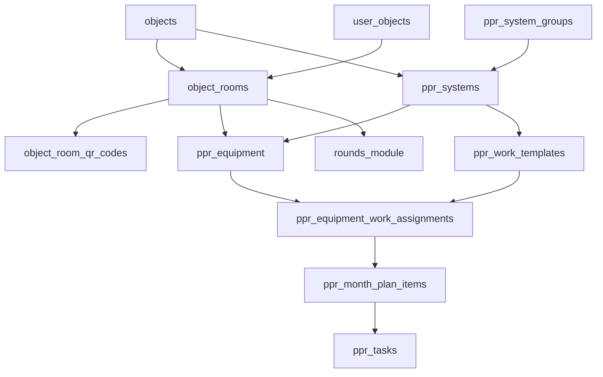

# Архитектура модуля ППР

## 1. Цель

`PPR` остаётся отдельным vertical slice внутри проекта, но уже работает поверх shared room layer и общей модульной архитектуры приложения:

- `Группа систем -> Система -> Оборудование`
- помещения не являются PPR-specific справочником
- помещения обслуживаются через общий `object_rooms`
- room QR и room card являются shared-сущностями, доступными не только ППР

Ключевые принципы:

- `ppr_tasks` не смешиваются с обычными `tasks`;
- UI, API и workflow ППР остаются отдельным доменом;
- shared-слой переиспользует auth, roles, objects, user_objects, audit, rooms и object scope.

## 2. Итоговая доменная модель

### 2.1 Shared-слой

- `objects`
- `user_objects`
- `object_rooms`
- `floors`
- `room_types`
- `object_room_qr_codes`

`object_rooms` — это общий справочник помещений объекта, который уже используется одновременно `PPR` и `Rounds`.

### 2.2 PPR-слой

- `ppr_system_groups`
- `ppr_systems`
- `ppr_equipment`
- `ppr_work_templates`
- `ppr_work_checklist_items`
- `ppr_equipment_work_assignments`
- `ppr_month_plans`
- `ppr_month_plan_items`
- `ppr_tasks`
- `ppr_task_work_items`
- `ppr_task_comments`
- `ppr_task_attachments`
- `ppr_equipment_qr_codes`
- `ppr_equipment_attachments`

### 2.3 Что считается legacy

- `ppr_subsystems`
- `subsystem_id` в рабочем UI и query-layer
- любые формы и экраны, требующие `subsystem_id`
- PPR-specific справочник `ppr_rooms`

## 3. Связи между сущностями

Правила:

- оборудование принадлежит системе напрямую;
- шаблон ППР принадлежит системе напрямую;
- совместимость назначения проверяется по `object_id + system_id`;
- помещение принадлежит объекту, а не ППР;
- `ppr_tasks` materialize-ятся по `(object_id, equipment_id, planned_for)`;
- room QR принадлежит помещению, а не конкретному модулю.

## 4. App-слой

### 4.1 Страницы

- `app/(dashboard)/ppr/page.tsx`
- `app/(dashboard)/ppr/system-groups/page.tsx`
- `app/(dashboard)/ppr/systems/page.tsx`
- `app/(dashboard)/ppr/rooms/page.tsx`
- `app/(dashboard)/ppr/rooms/[id]/page.tsx`
- `app/(dashboard)/ppr/rooms/qr/[token]/page.tsx`
- `app/(dashboard)/ppr/equipment/page.tsx`
- `app/(dashboard)/ppr/equipment/[id]/page.tsx`
- `app/(dashboard)/ppr/templates/page.tsx`
- `app/(dashboard)/ppr/templates/[id]/page.tsx`
- `app/(dashboard)/ppr/assignments/page.tsx`
- `app/(dashboard)/ppr/calendar/page.tsx`
- `app/(dashboard)/ppr/tasks/page.tsx`
- `app/(dashboard)/ppr/tasks/[id]/page.tsx`
- `app/(dashboard)/ppr/my/page.tsx`
- `app/(dashboard)/ppr/archive/page.tsx`
- `app/(dashboard)/ppr/qr/[token]/page.tsx`

Маршрут `/ppr/subsystems` считается исторически удалённым.

### 4.2 Backend

- `app/actions/ppr-directory-actions.ts`
- `app/actions/ppr-template-actions.ts`
- `app/actions/ppr-calendar-actions.ts`
- `app/actions/ppr-task-actions.ts`
- `app/actions/object-room-actions.ts`
- `app/api/ppr/*`
- `app/api/ppr/rooms/[id]/qr/regenerate/route.ts`

### 4.3 Query и helper слой

Публичный контракт:

- `lib/ppr/queries.ts`

Фактическое внутреннее устройство:

- `lib/ppr/access.ts`
- `lib/ppr/structure-queries.ts`
- `lib/ppr/calendar-queries.ts`
- `lib/ppr/task-queries.ts`
- `lib/ppr/task-read-models.ts`
- `lib/ppr/scheduler.ts`
- `lib/ppr/task-lifecycle.ts`
- `lib/ppr/permissions.ts`
- `lib/ppr/qr.ts`

Shared helpers, на которые ППР теперь опирается:

- `lib/object-access.ts`
- `lib/relation-normalization.ts`
- `lib/object-rooms.ts`
- `lib/object-room-qr.ts`

## 5. Room layer и QR

### 5.1 Что важно для ППР

- `/ppr/rooms` — это уже shared room directory, а не внутренний PPR-only каталог;
- `/ppr/rooms/[id]` показывает room card с общим QR и флагом `rounds_enabled`;
- `/ppr/rooms/qr/[token]` ведёт в room card;
- room QR создаётся автоматически при создании помещения;
- из карточки room QR можно регенерировать вручную.

### 5.2 Почему это важно архитектурно

ППР теперь работает с помещением как с shared entity:

- оборудование привязывается к общей комнате;
- room card и room QR уже принадлежат shared-слою;
- `Rounds` использует ту же комнату и тот же QR, но по своей бизнес-логике.

## 6. Календарь ППР

Текущее состояние календаря:

- yearly overview + monthly operational view;
- генерация месячного плана по системе;
- materialization позиций в `ppr_tasks`;
- drag-and-drop перенос внутри месяца;
- fallback-формы ручного переноса;
- lazy splitting тяжёлых monthly частей;
- route-level `loading.tsx` и module-level `error.tsx`.

Архитектурно календарь больше не является giant client file:

- pure selectors вынесены отдельно;
- UI разбит на year view / month section / filters drawer / item drawers;
- часть тяжёлых client subparts грузится через dynamic import.

## 7. Карточка ППР-заявки

Реализовано:

- lifecycle controls;
- комментарии;
- фото;
- attachment gallery;
- snapshot work items;
- синхронизация с `ppr_month_plan_items`.

После remediation:

- карточка читает attachments через server-side read model;
- attachment waterfall по комментариям убран;
- тяжёлые client-only части деталей задачи вынесены в lazy chunks.

## 8. RLS и доступ

PPR использует многослойную модель доступа:

- page-level guards;
- API/session guards;
- `lib/ppr/permissions.ts`;
- query-level access gates;
- shared object scope;
- RLS.

Отдельно:

- `engineer` в календаре ограничен ответственностью по системе;
- `object_engineer` и `lead` завязаны на object scope;
- shared object scope теперь централизован, а не размазан по доменным модулям.

## 9. Workflow

### Шаблон

- создаётся на уровне системы;
- содержит периодичность, базовую дату, чек-лист, нормо-часы и методику.

### Назначение

- связывает шаблон и оборудование;
- разрешено только в рамках одной системы и одного объекта.

### Календарь

- создаётся month plan по системе;
- строки плана хранят конкретные due dates и `planned_for`;
- переносы ограничены рамками выбранного месяца.

### Materialization

- одна активная `ppr_task` на одно оборудование и одну плановую дату;
- grouping key: `(object_id, equipment_id, planned_for)`;
- `ppr_task_work_items` хранят snapshot работ.

### Выполнение

- исполнитель назначается на уровне готовой `ppr_task`;
- `done` требует комментарий и фото;
- `closed` и `cancelled` синхронизируются с month plan items.

## 10. Практические ограничения

- `PPR` и обычные `tasks` остаются независимыми доменами;
- часть transport-логики ППР по-прежнему распределена между `API routes` и `server actions`;
- room layer общий, поэтому изменения в помещениях нужно проверять не только в `PPR`, но и в `Rounds`;
- календарь стал легче и чище, но остаётся одним из самых сложных участков системы.
